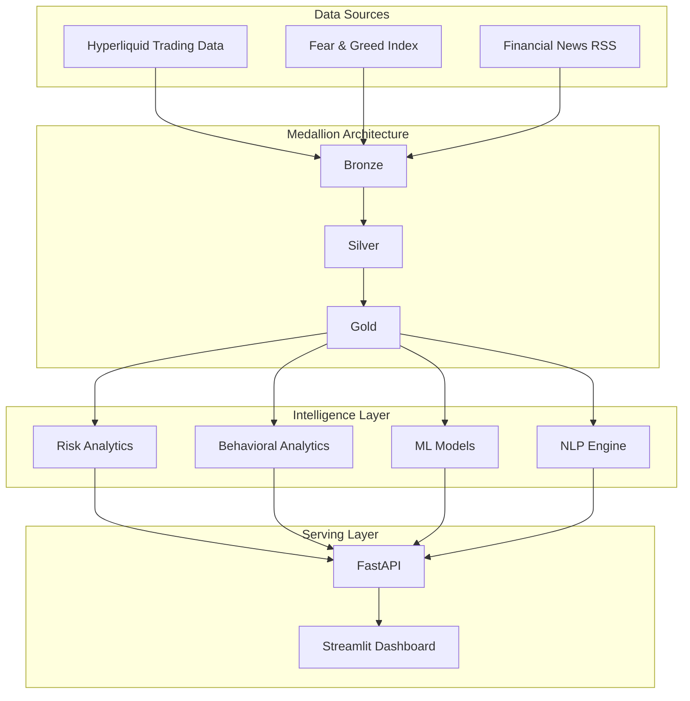

# QuantSentinel AI 📈🤖

### Sentiment-Driven Quantitative Crypto Intelligence & Behavioral Risk Platform


---

## 📖 Overview

QuantSentinel AI is an end-to-end quantitative finance and behavioral analytics platform that analyzes how market sentiment influences trader profitability, leverage decisions, execution risk, and behavioral biases in cryptocurrency markets.

The platform combines:

* Hyperliquid trading activity
* Bitcoin Fear & Greed Index
* Live financial news feeds
* Machine Learning models
* Quantitative risk analytics
* Explainable AI (SHAP)
* NLP sentiment intelligence

to uncover actionable insights about market psychology and trading performance.

---

## 📊 Highlights

* 🧠 Behavioral Finance Intelligence (FOMO, Panic Selling, Overconfidence, Loss Chasing)
* 🤖 Trade Profitability Prediction using Machine Learning
* 📉 VaR, CVaR, Sharpe, Sortino, and Calmar Risk Analytics
* 📈 Market Regime Detection & Portfolio Simulation
* 📰 Real-Time Financial News Sentiment Analysis
* 🔍 SHAP-Based Explainable AI
* 🗄️ Bronze → Silver → Gold Medallion Architecture
* ⚡ FastAPI Microservices + Streamlit Dashboard
* 📋 Data Quality Monitoring & Pipeline Observability
* 🐳 Dockerized Deployment

---

## 🏗️ System Architecture



---

## ✨ Core Features

### 🧠 Behavioral Finance Intelligence
This is the platform's primary differentiator. It calculates a proprietary `Behavioral Risk Score` based on NLP sentiment momentum and market volatility, actively detecting retail cognitive biases:
* **FOMO (Fear Of Missing Out):** High positive sentiment + high volatility.
* **Panic Selling:** Severe negative sentiment + extreme downside volatility.
* **Overconfidence:** Sustained high sentiment + low volatility.
* **Loss Chasing:** Rebounding sentiment after severe drops.

### 📉 Risk Analytics
Implements institutional-grade portfolio risk metrics programmatically:
* **Value-at-Risk (VaR) & Conditional VaR (CVaR)** at 95% confidence intervals.
* **Sharpe, Sortino, and Calmar Ratios** for risk-adjusted return analysis.
* **Kelly Criterion Integration:** Dynamically adjusting recommended capital allocation based on win-rate probabilities and sentiment extremes.

### 🗣️ NLP Intelligence
A robust pipeline designed to extract nuanced market signals from unstructured text:
* **FinBERT:** Domain-specific financial sentiment analysis for high-accuracy inference.
* **Lexicon Fallbacks:** VADER & TextBlob for rapid sentiment scoring.
* **Entity Extraction & Impact Scoring:** Isolating key crypto assets and evaluating the localized impact of news.

### 🤖 ML Models
* **Supervised Learning:** Random Forest classifier predicts near-term trade directions (Bullish/Bearish).
* **Unsupervised Learning:** K-Means clustering detects hidden market regimes based on volatility and sentiment clusters.
* **Explainability:** SHAP (SHapley Additive exPlanations) is integrated to transparently explain *why* the model made a specific prediction.

### 🗄️ Data Engineering
* **Medallion Architecture:** Strict Bronze (Raw) → Silver (Cleaned) → Gold (Aggregated) progression.
* **dbt Pipelines:** SQL-based transformations ensure data is clean, tested, and documented.
* **Real News Ingestion:** Bypasses synthetic datasets by pulling live financial data directly from industry-standard RSS feeds.

---

## 🖥️ Dashboard Features

The Streamlit frontend is broken down into specialized centers:
* **Analytics Dashboard:** Real-time sentiment scoring, ML regime detection, and behavioral metrics.
* **Data Quality Center:** Real-time monitoring of total records, missing values, duplicates, outliers, and drift status with `PASS`, `WARNING`, and `FAILED` badges.
* **Observability Center:** Pipeline execution tracking, API health checks, model F1 score, runtime logging, and rows processed.

---

## 🔌 API Features

The platform exposes a fully documented, microservice-based API Developer Portal via **FastAPI**:
* `GET /health` - System status.
* `GET /predict` - Fetch latest ML trade predictions and SHAP explanations.
* `GET /risk` - Fetch real-time VaR, CVaR, and Behavioral Risk Scores.
* `GET /data-quality` - Fetch Bronze/Silver/Gold pipeline integrity metrics.

---

## 📁 Datasets

### Hyperliquid Historical Trading Dataset

https://drive.google.com/file/d/1IAfLZwu6rJzyWKgBToqwSmmVYU6VbjVs/view?usp=sharing

### Bitcoin Fear & Greed Dataset

https://drive.google.com/file/d/1PgQC0tO8XN-wqkNyghWc_-mnrYv_nhSf/view?usp=sharing

### Live News Sources

* CoinDesk RSS
* CoinTelegraph RSS
* Yahoo Finance Crypto RSS

---

## 🚀 Quick Start

### Install Dependencies

```bash
pip install -r requirements.txt
```

### Run Pipeline

```bash
python src/download_data.py
python src/news_ingestion.py
python src/bronze_to_silver.py
python src/silver_to_gold.py
python src/ml_engine.py
```

### Start API

```bash
uvicorn src.api:app --reload
```

### Start Dashboard

```bash
streamlit run src/dashboard.py
```

---

## 🛠️ Tech Stack

| Domain           | Technologies                        |
| ---------------- | ----------------------------------- |
| Backend          | FastAPI, Uvicorn                    |
| Frontend         | Streamlit, Plotly                   |
| Data Engineering | Pandas, dbt, Medallion Architecture |
| Machine Learning | Scikit-Learn, SHAP                  |
| NLP              | FinBERT, VADER, TextBlob            |
| Deployment       | Docker, Docker Compose              |
| Testing          | PyTest                              |

---

## 📈 Key Findings

* Traders operating under Fear regimes demonstrated stronger risk-adjusted returns than standard Greed environments.
* High-leverage positions exhibited significantly higher downside risk and liquidation exposure.
* Behavioral biases such as FOMO and Loss Chasing frequently preceded deteriorating profitability.
* Sentiment-aware portfolio sizing outperformed static allocation strategies in historical simulations.

---


## 📄 License

Licensed under the MIT License.
